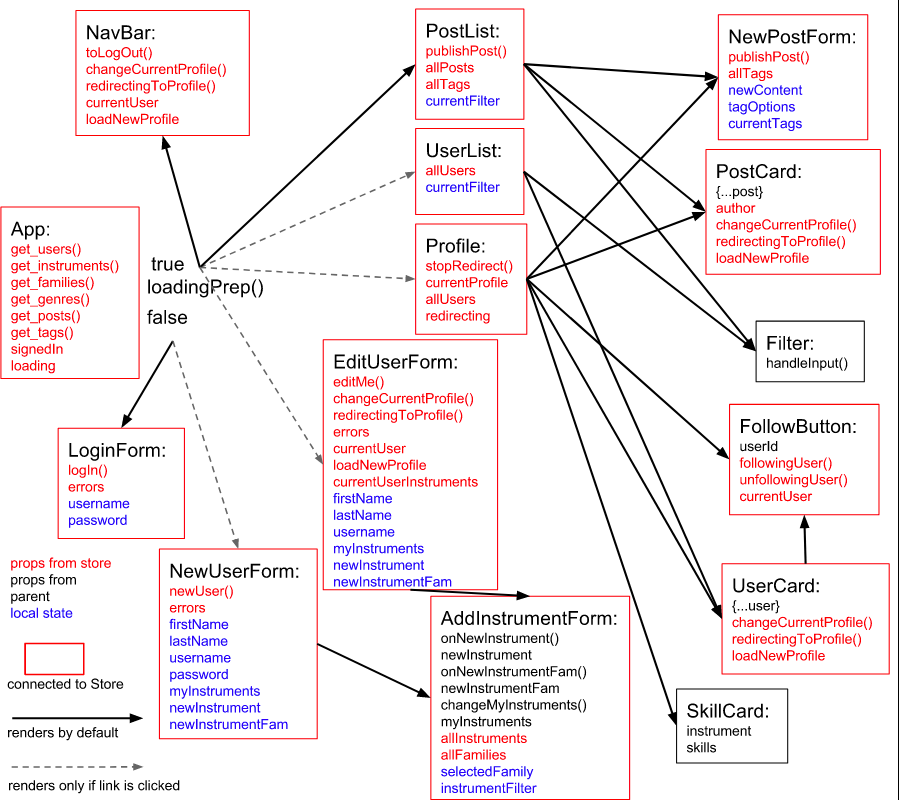

# syncedIn-frontend

demo: https://www.youtube.com/watch?v=U9JzufNzcGU&t=15s

backend repo: https://github.com/annabush092/syncedIn-backend

built with: React, Redux, React-Router, Thunk middleware

To run:

yarn install

yarn start (be sure to start the backend server first, and when prompted, type 'y' to start the server on a different port)

Component Structure:

*/
TODO:

Priority:

  Move error state into the loadingReducer instead of the userReducer.
  Move error check into loadingPrep

  window.scrollTo(0, 0) in componentDidMount() ensures all pages load scrolled to the top of the page

Refactoring/fixing not priority:

  When you re-load a profile page, it gets messed up (same problem)- try putting the profile state check in App instead of where it is...

  Find a way to display the error state in App if anything goes wrong. Something like github errors?
  Catch error in frontend if server is down and sends any response besides 200...

  Make an adapter file for all fetch actions
  Move login actions to their own file

  When making an update in the backend (follow/unfollow, update, make new user), instead of re-fetching the user.list to update the store, do something less costly...

Features not priority:

  Expand NewUserForm and EditUserForm to add genre/skills.

  Make the user interface to change password more secure (have them type it twice)
  Make users enter their password to verify before making any changes to their profile.
  Also allow a user to change their password

  have JWT auth control the rest of the fetch requests in App

  give posts a time converted to the user's timezone

Stretch refactors:
  Normalize frontend data structure
  Make readme's good- tell how to run/install, and exactly what the API returns for different requests
  Worth it to disconnect UserCard/PostCard from the store? Is it slowing me down at all?
  Protect params in backend (require/permit)

Random stretch features:

  Add instrument families to search users filter

  Expand users so they have more information in backend
  Incorporate equipment- if someone plays the bass clarinet, do they have one? Especially important for percussion
  Add a 'willing-to-learn' category for instruments and genres in a user profile
  Location of musicians!
  Allow musicians to upload a resume, what they're currently working on, past schools, bio, etc

  Allow users to create new Genres. Before creating the genre, try to match it with something that already exists, and ask them to choose one or create a new one anyways. (Try to search for each individual word inside other genre names to see if there are any matches?)

  Can users rank their instruments so the userCard shows the most important ones? (userCard shows perform=true instruments)

  Add pictures for each instrument and genre to display on profile instrument cards

  Allow users to link to each other in posts (think of twitter- you can follow people or mention their name in a tweet to get their attention)

  Allow users to directly message each other, but also give them the option to block direct messages

  */
